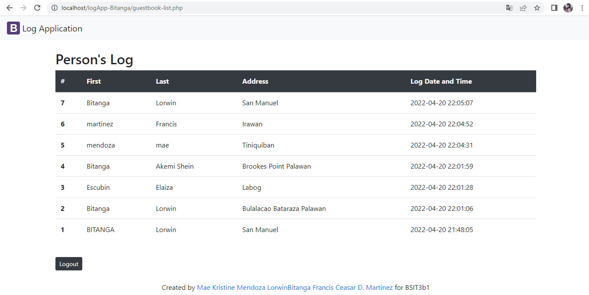

# logApp-scaling-octo
# logApp-scaling-octo

This repo is for Practice Set 5-06

# Log App
 Documentation

-This is a web application with a file for guestlogin, guestlist, and guestlogout. The format and content of the log-app are determined by the admin.And this project was built with PHP and HTML-CSS.

# :pager: Log App Page
 
 # :computer: Registration Form
 

 # :computer: Guestbook-Login
 
 
 # :computer: Guestbook-list
 

**********************

#  :file_folder: Installation

1. Open Command line interface  (CMD)

2. Go to  Github account, copy the remote repository link, and use cmd to clone the remote repository to your computer. 

3. Moved the cloned repository to what server you use ("Xampp or wamp").

5. Open cmd create or add a file, then push it to your existing repository using command line.

6. Open your browser and go to phpMyAdmin. 

7. Import the database in phpmyadmin of logApp named logapp-bitanga.sql

8.  Go to "http://localhost/logApp-Bitanga/index.php" then start exploring it.

*************************

 #  Authors :raising_hand:

 # :ok_woman: Lorwin Bitanga
 

 # :woman: Mae Kristine Mendoza
 

 # :man: Francis 

 

